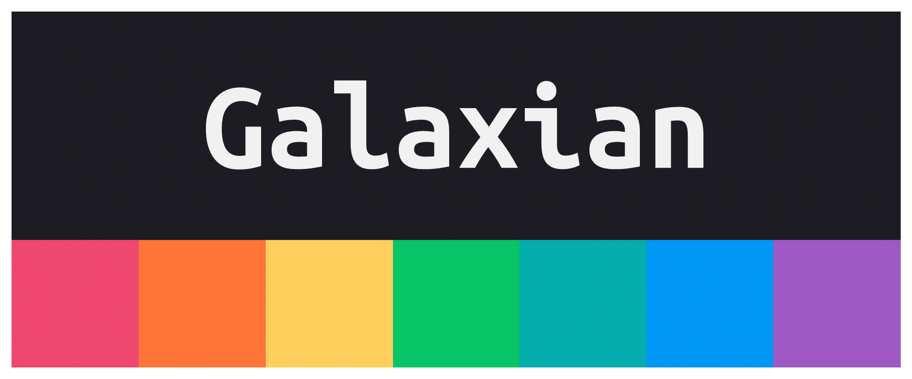
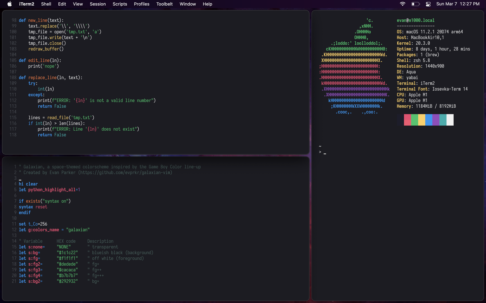

  <h3>Galaxian is a dark, colorful, easy-on-the-eyes colorscheme for Vim</h3>

 

### Installation
Simply download ``galaxian.vim`` and put it in your ``/.vim/colors/`` folder, then add ``colorscheme galaxian`` to your ``.vimrc`` file. That's it!

If your colors don't look right, and you're using the terminal version of Vim, try adding ``set termguicolors`` to your ``.vimrc`` file **before** you set the colorscheme. If that doesn't work, check to make sure your terminal supports true color. If your terminal *does* have true color support and it still doesn't look right, open an issue and I'll see if I can help out. I'm new at this still and I might have done something wrong.

### Customization
I've commented the code well enough that you should be able to customize the colors and highlight groups to your liking fairly easily. I recommend reading the ``highlight-groups`` section of the [Vim docs](http://vimdoc.sourceforge.net/htmldoc/syntax.html#:highlight) to find what you're looking to highlight, and you can probably figure out how to apply highlights by looking at what's already in the ``galaxian.vim`` file.

### Can you add support for X language?
I've so far only added basic syntax highlighting, plus some extras for Python. Galaxian will *work* with all languages, but may not look exactly like the screenshots, especially if you're using a different syntax highlighting method than the default. 

I plan to add more languages, but I'm only going to add the ones I'm familiar with so they'll actually look good. If you want to see your favorite language in Galaxian colors, please make a pull request for it and we'll get it done!

If you found that I've missed anything obvious, please open an issue and I'll fix it. I can't seem to find a reliable way to test all of the various parts of Vim that have color, so I'm just sort of testing as I go.

